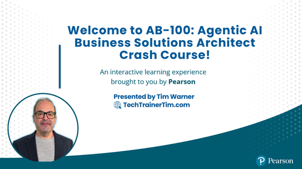

<!-- Cover Image -->
<p align="center">
  
</p>

<p align="center">
  <a href="https://TechTrainerTim.com"></a>
  <a href="https://www.youtube.com/c/TechTrainerTim"></a>
  <a href="https://opensource.org/licenses/MIT"></a>
  <a href="https://www.linkedin.com/in/timothywarner"></a>
  <a href="https://discord.com/users/timwarner1"></a>
  <a href="https://mvp.microsoft.com/en-US/mvp/profile/e9a13bca-2798-4247-be56-f116f780869d"></a>
  <a href="https://learn.microsoft.com/credentials/certifications/exams/ab-100/"></a>
</p>

# AB-100: Agentic AI Business Solutions Architect

Welcome! This is the official learning hub for my O'Reilly Live Training course, **Agentic AI Business Solutions Architect**, and a comprehensive study guide for Microsoft's **AB-100** certification exam.

> **Delight is the name of the game.**
> Friendly, human, and neurodivergent-friendly — just like Tim Warner's teaching style.
> Emoji? Yes, but not too many. Clarity? Always.

---

## 🎯 Exam Overview

| Detail | Information |
|--------|-------------|
| **Exam Code** | AB-100 |
| **Title** | Agentic AI Business Solutions Architect |
| **Focus** | AI-driven business solutions using Microsoft technologies |
| **Target Audience** | Solution architects with AI expertise |

## 📊 Skills Measured

| Domain | Weight |
|--------|--------|
| [Plan AI-powered business solutions](./01-plan-ai-solutions/) | 25-30% |
| [Design AI-powered business solutions](./02-design-ai-solutions/) | 25-30% |
| [Deploy AI-powered business solutions](./03-deploy-ai-solutions/) | 40-45% |

---

## 📚 Repository Structure

```
ab100/
├── course/                        # O'Reilly Live Training materials
│   ├── COURSE_PLAN.md             # Complete 4-segment course plan
│   ├── demos/                     # Live demonstration scripts
│   ├── exercises/                 # Hands-on practice exercises
│   └── slides/                    # Slide deck outlines
├── 01-plan-ai-solutions/          # Planning domain (25-30%)
│   ├── analyze-requirements.md    # Requirements analysis
│   ├── ai-strategy.md             # AI strategy design
│   └── roi-analysis.md            # Cost-benefit analysis
├── 02-design-ai-solutions/        # Design domain (25-30%)
│   ├── agents-design.md           # Agent design patterns
│   ├── extensibility.md           # AI solution extensibility
│   └── orchestration.md           # Configuration orchestration
├── 03-deploy-ai-solutions/        # Deploy domain (40-45%)
│   ├── monitoring.md              # Analysis and monitoring
│   ├── testing.md                 # Testing strategies
│   ├── alm-process.md             # ALM for AI solutions
│   └── security-governance.md     # Security and compliance
├── resources/
│   ├── links.md                   # Official documentation links (400+)
│   ├── cheat-sheet.md             # Quick reference guide
│   └── glossary.md                # Key terms and definitions
└── practice/
    └── scenarios.md               # Practice scenarios
```

---

## 🎓 O'Reilly Live Training

This repository serves as the companion materials for the **Agentic AI Business Solutions Architect** O'Reilly Live Training course.

**Course Duration:** 4 hours (four 50-minute segments)

| Segment | Topic | Materials |
|---------|-------|-----------|
| 1 | Planning AI Solutions | [Demos](course/demos/segment1-roi-calculator.md) • [Exercises](course/exercises/segment1-exercises.md) |
| 2 | Designing AI Solutions | [Demos](course/demos/segment2-multi-agent-build.md) • [Exercises](course/exercises/segment2-exercises.md) |
| 3 | Deploying AI Solutions | [Demos](course/demos/segment3-deployment-monitoring.md) • [Exercises](course/exercises/segment3-exercises.md) |
| 4 | Security & Exam Mastery | [Demos](course/demos/segment4-security-stack.md) • [Exercises](course/exercises/segment4-exercises.md) |

See the [Course Plan](course/COURSE_PLAN.md) for full details.

---

## 👤 Candidate Profile

As a candidate for this exam, you should have expertise in:

- **AI Architecture** — Designing solutions using AI, generative AI, and various AI services
- **Agentic Solutions** — Building agentic-first and multi-agent orchestrated solutions
- **Microsoft Stack** — Dynamics 365, Power Platform, Copilot Studio, Azure AI services, Azure OpenAI
- **Protocols** — Agent2Agent (A2A) and Model Context Protocol (MCP)
- **Responsible AI** — Compliance and Microsoft responsible AI guidelines
- **Security** — Securing AI models, data workflows, and defending against prompt manipulation

---

## 🛠️ Key Technologies

### Microsoft Platforms
- **Microsoft 365 Copilot** — Enterprise AI assistant
- **Copilot Studio** — Custom agent development
- **Azure AI Foundry** — AI model development and deployment
- **Azure AI Services** — Cognitive services and APIs
- **Azure OpenAI** — GPT models and embeddings

### Business Applications
- **Dynamics 365 Sales** — CRM and sales automation
- **Dynamics 365 Customer Service** — Service management
- **Dynamics 365 Finance** — Financial operations
- **Dynamics 365 Supply Chain Management** — Operations management
- **Power Platform** — Low-code development

---

## 🚀 How to Use This Repo

1. **Clone the repo:**
   `git clone https://github.com/timothywarner-org/ab100.git`
2. **Start with Planning (25-30%)** — Understand requirements and strategy in [`01-plan-ai-solutions/`](./01-plan-ai-solutions/)
3. **Move to Design (25-30%)** — Learn architecture patterns in [`02-design-ai-solutions/`](./02-design-ai-solutions/)
4. **Focus on Deployment (40-45%)** — Master implementation and operations in [`03-deploy-ai-solutions/`](./03-deploy-ai-solutions/)
5. **Reference the [cheat sheet](./resources/cheat-sheet.md)** for quick reviews, and the [glossary](./resources/glossary.md) for unfamiliar terms
6. **Practice with [scenarios](./practice/scenarios.md)** to test your knowledge

---

## 📖 Learning Resources

### Official Microsoft Resources
- [Azure AI Foundry Documentation](https://learn.microsoft.com/azure/ai-studio/)
- [Azure AI Services](https://learn.microsoft.com/azure/ai-services/)
- [Copilot Studio Documentation](https://learn.microsoft.com/microsoft-copilot-studio/)
- [Power Platform Documentation](https://learn.microsoft.com/power-platform/)
- [Dynamics 365 Documentation](https://learn.microsoft.com/dynamics365/)

### Training Paths
- [Microsoft Learn — AI Fundamentals](https://learn.microsoft.com/training/paths/get-started-with-artificial-intelligence-on-azure/)
- [Copilot Studio Learning Path](https://learn.microsoft.com/training/paths/work-power-virtual-agents/)
- [Azure AI Engineer Associate](https://learn.microsoft.com/credentials/certifications/azure-ai-engineer/)

### Community Resources
- [Microsoft Q&A](https://learn.microsoft.com/answers/)
- [Microsoft Tech Community](https://techcommunity.microsoft.com/)
- [Microsoft MVP Program](https://mvp.microsoft.com/)

---

## 🤝 Contributing
- PRs, issues, and feedback are welcome!
- Feel free to submit issues or pull requests to improve this study guide.

---

## 🧠 Neurodivergent-Friendly, Always
This repo is designed for clarity, accessibility, and delight.
If you have suggestions to make it even more inclusive, please let me know!

---

## ⚠️ Disclaimer

This is an **unofficial** study guide. Always refer to the [official Microsoft exam page](https://learn.microsoft.com/credentials/certifications/exams/ab-100/) for the most current information.

---

## 📜 License

MIT License. See [`LICENSE`](./LICENSE) for details.
